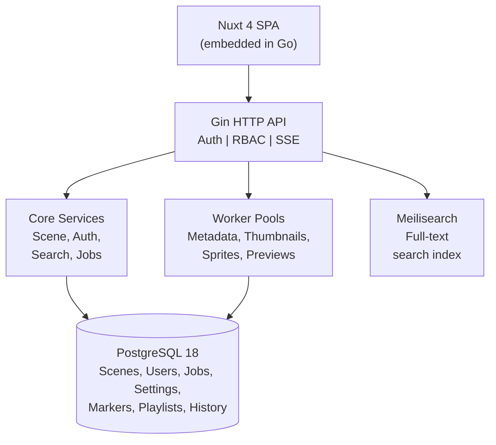

<div align="center">


# GoonHub

### Your private, self-hosted NSFW video library

A powerful, privacy-first platform to organize, process, and stream your adult video collection - entirely on your own hardware.

[](docker/)
[](go.mod)
[](web/)
[](LICENSE)

</div>

---

## Why GoonHub?

Most video management tools are either too basic (a folder of files) or too invasive (cloud-hosted services that see everything). GoonHub fills the gap: a **professional-grade video library** that runs entirely on your machine, with features that rival commercial platforms.

- **Zero cloud dependency** - Your content never leaves your network
- **Automatic processing** - Thumbnails, sprite sheets, animated previews generated for you
- **Smart search** - Full-text search with 12+ filter types across your entire library
- **Multi-user ready** - Role-based access control for shared setups

---

## Features

### Automatic Video Processing Pipeline

Upload a video and GoonHub handles the rest. A multi-phase processing pipeline extracts metadata, generates thumbnails, creates seekbar previews, and builds animated previews - all in the background with real-time progress tracking.


- **Metadata extraction** - Duration, resolution, codecs, bitrate detected automatically via ffprobe
- **Dual-resolution thumbnails** - Small (320px) for grids, large (1280px) for detail views, both in WebP
- **Sprite sheet generation** - Grid of frames (configurable, default 96 frames) with VTT timing for seekbar hover preview
- **Animated scene previews** - Short MP4 clips sampling segments throughout the video, giving you a quick preview before watching
- **Animated marker previews** - Looping video clips at each bookmarked timestamp
- **Configurable quality** - CRF, resolution, frame intervals, WebP quality all tunable
- **Non-blocking queue** - DB-backed job queue handles 80,000+ videos without memory issues; workers process in parallel

---

### Full-Text Search with Advanced Filtering

Find exactly what you're looking for. Powered by Meilisearch, GoonHub delivers instant search results with filters that go far beyond basic text matching.


- **Instant full-text search** - Searches across titles, descriptions, filenames, actors, and tags
- **12+ filter types** - Tags, actors, studio, duration range, date range, resolution, rating range, liked status, jizz count, marker labels, match type, and sort order
- **Smart sort options** - Newest, oldest, alphabetical, random (with shareable seed), most viewed, longest, highest rated
- **Saved searches** - Store your favorite filter combinations for one-click access
- **URL-persisted filters** - Share or bookmark any search configuration; browser back/forward works naturally
- **User-specific filtering** - Filter by your personal ratings, likes, and watch data

---

### Scene Player with Rich Metadata

A full-featured video player with inline metadata editing, scene bookmarks, and interactive tracking - all on one page.


- **Seekbar thumbnail preview** - Hover over the timeline to see frame previews from generated sprite sheets
- **Resume playback** - Automatically remembers where you left off in every video
- **Keyboard shortcuts** - Space/K (play/pause), J/L (skip 10s), 0-9 (jump to %), F (fullscreen), T (theater mode), M (add marker)
- **Inline metadata editing** - Click any field to edit: title, description, release date, tags, actors, studio
- **Star ratings** - 1-10 scale with hover preview
- **Like & jizz count** - Personal interaction tracking per scene
- **View counting** - Automatic, deduplicated per user per 24h
- **Related scenes** - Score-weighted suggestions based on shared actors, tags, and studio
- **Processing status** - See the current processing state and reprocess if needed

---

### Scene Markers (Bookmarks)

Create timestamped bookmarks within any video. Each marker gets its own thumbnail - static or animated - and can be tagged and organized by label.


- **One-click creation** - Press M during playback to drop a marker at the current timestamp
- **Custom labels & colors** - Organize markers by category with color-coded labels
- **Animated previews** - Short looping video clips at each marker position (3-15 seconds, configurable)
- **Tag markers individually** - Apply tags to specific markers or entire label groups
- **Dedicated markers hub** - Browse all markers across your library, grouped by label or flat
- **Click-to-jump** - Click any marker to jump directly to that scene and timestamp

---

### Playlists

Curate collections of scenes with full playback control - reorder, shuffle, auto-advance, and track your progress.


- **Drag-and-drop reordering** - Arrange scenes in any order
- **Auto-advance with countdown** - Configurable countdown (5-30s) before the next scene plays
- **Shuffle mode** - Seeded randomization so shuffled order is reproducible and shareable
- **Progress tracking** - Resume the playlist from where you left off
- **Visibility controls** - Private, public, or unlisted playlists
- **Create from search** - Convert any search result into a playlist with one click
- **Playlist sidebar** - See your full playlist alongside the player, jump to any scene

---

### Actors, Studios & Tags

Rich metadata management for performers, production studios, and custom tags - with dedicated browsing pages and scene associations.


- **Actor profiles** - Name, aliases, gender, birthday, physical attributes, career info, profile images
- **Studio profiles** - Name, URL, description, logo, parent network relationships
- **Custom tags with colors** - Create tags with custom color coding for visual organization
- **Dedicated browse pages** - `/actors`, `/studios`, `/markers` each with search, sort, and pagination
- **Scene associations** - Link any scene to multiple actors, a studio, and unlimited tags
- **Bulk association** - Assign actors, studios, or tags to entire folders at once

---

### File Explorer & Bulk Operations

Browse your video library by folder structure. Select multiple scenes and apply operations in bulk - tag, assign actors, match metadata, or delete.


- **Folder navigation** - Browse your storage paths like a file manager with breadcrumb navigation
- **Multi-select** - Ctrl+A to select all, Shift+Click for ranges, checkboxes for individual picks
- **Bulk tagging** - Apply tags to dozens of scenes at once
- **Bulk actor/studio assignment** - Set performers or studios for entire folders
- **Bulk PornDB matching** - Match multiple scenes against ThePornDB with confidence scoring and review before applying
- **Bulk delete** - Remove multiple scenes with a single confirmation

---

### PornDB Integration

Automatically enrich your library with metadata from ThePornDB. Search for scene info, match performers, and pull in tags, descriptions, and images.

- **Scene search** - Query ThePornDB by filename or title to find metadata matches
- **Performer lookup** - Search and link actors from ThePornDB's database
- **Auto-import metadata** - Pull in title, description, tags, actors, studio, and thumbnail images
- **Bulk matching** - Match entire folders of scenes with progress tracking and confidence scores
- **Review before applying** - Preview matched metadata and cherry-pick what to import

---

### Customizable Homepage

Configure your landing page with the sections that matter to you. Mix and match recent uploads, watched scenes, liked content, tag-based collections, and more.

- **Drag-to-reorder sections** - Arrange your homepage layout exactly how you want it
- **Section types** - Recent uploads, recently watched, liked scenes, tag carousels, playlist collections, random picks
- **Per-user configuration** - Each user sees their own personalized homepage
- **Section customization** - Set the number of items and custom titles for each section

---

### Watch History & Activity

Track your viewing habits with a timeline view and activity chart. See what you watched, when, and pick up where you left off.


- **Timeline view** - Date-grouped list (Today, Yesterday, etc.) of watched scenes
- **Activity chart** - Visual bar chart showing daily watch activity
- **Date range filtering** - Last 7/30/90 days or custom range
- **Resume from anywhere** - Every scene remembers your last position

---

### Real-Time Job Monitoring

Watch your processing queue in real-time. The header badge shows active jobs, and a detailed popup breaks down progress by phase.

- **Header indicator** - Always-visible badge showing running, queued, and failed job counts
- **Phase breakdown** - See queue depth for metadata, thumbnail, sprites, and animated preview phases
- **SSE-powered updates** - No polling; updates stream in real-time via Server-Sent Events
- **Auto-reconnection** - Handles connection drops and resyncs automatically

---

### Admin Dashboard

Full control over processing, workers, scheduling, retries, and user management - all from the settings panel.

- **Dynamic worker pools** - Adjust worker count per phase at runtime, no restart needed
- **Processing configuration** - Tune thumbnail resolution, sprite grid size, preview quality, CRF values
- **Scheduled triggers** - Cron-based scheduling for automated processing (e.g., regenerate sprites nightly)
- **Trigger types** - `on_import`, `after_job`, `manual`, `scheduled` with cycle detection for dependencies
- **Retry configuration** - Per-phase retry policies with exponential backoff
- **Dead letter queue** - Review and retry permanently failed jobs, or abandon them
- **User management** - Create users, assign roles, reset passwords, delete accounts
- **RBAC** - Fine-grained permissions (scenes:upload, scenes:trash, etc.) enforced at API level
- **Trash management** - View soft-deleted scenes, restore or permanently purge
- **Storage paths** - Add, edit, or remove video directories; trigger scans for new files
- **Manual bulk processing** - Reprocess metadata, thumbnails, sprites, or previews for all scenes or only missing ones

---

### Smart File Scanning

Point GoonHub at your video directories and it automatically discovers new files, detects moved files, and avoids duplicates.

- **Automatic discovery** - Scans configured storage paths for new video files (MP4, MKV, AVI, MOV, WEBM, WMV, M4V)
- **Move detection** - Recognizes files that have been moved between folders (via size + filename matching) to avoid duplicates
- **Batch creation** - Efficient batch processing (50 scenes per DB flush)
- **Real-time progress** - SSE-powered progress updates during scans
- **Orphan detection** - Automatically trashes scenes whose files are no longer found

---

### Security & Multi-User

Built for privacy from the ground up, with proper authentication, authorization, and account protection.

- **PASETO tokens** - Modern, secure token format (no JWT vulnerabilities)
- **Role-based access control** - Admin and user roles with fine-grained permissions
- **Account lockout** - Automatic lockout after failed login attempts (configurable threshold and duration)
- **Login rate limiting** - Per-IP rate limiting on authentication endpoints
- **Token revocation** - Proper logout with server-side token invalidation
- **Cross-tab sync** - Logout propagates across all open browser tabs
- **Security headers** - X-Frame-Options, CSP, HSTS, X-Content-Type-Options

---

## Tech Stack

| Layer | Technology |
|-------|-----------|
| Backend | Go 1.24, Gin, GORM |
| Frontend | Nuxt 4, Vue 3, Tailwind CSS 4, Pinia 3 |
| Database | PostgreSQL 18 |
| Search | Meilisearch v1.33 |
| Video Processing | ffmpeg / ffprobe |
| Auth | PASETO v2 symmetric |
| Player | video.js 8, media-chrome 4 |
| DI | Google Wire |
| Deployment | Docker, multi-arch (amd64/arm64) |

---

## Quick Start

### Docker Compose (Recommended)

```bash
git clone https://github.com/your-org/goonhub.git
cd goonhub/docker

# Set your secrets
cp .env.example .env
# Edit .env with your passwords and keys

# Start everything
docker compose -f docker-compose.prod.yml up -d
```

GoonHub will be available at `http://localhost:8080`. An admin account is created automatically on first startup.

### From Source

```bash
# Prerequisites: Go 1.24+, Bun, ffmpeg, PostgreSQL, Meilisearch

# Frontend build
cd web && bun install && bun run generate && cd ..

# Backend build
go build -o goonhub ./cmd/server

# Run
GOONHUB_CONFIG=config.yaml ./goonhub
```

### Configuration

All settings are configured via YAML file or environment variables:

```bash
# Via config file
GOONHUB_CONFIG=/path/to/config.yaml ./goonhub

# Via environment variables (dots become underscores)
GOONHUB_SERVER_PORT=8080 \
GOONHUB_DATABASE_PASSWORD=secret \
GOONHUB_AUTH_PASETO_SECRET=$(openssl rand -base64 32 | head -c 32) \
./goonhub
```

See [`docker/config.prod.yaml`](docker/config.prod.yaml) for all available configuration options.

---

## Architecture




**Key architectural decisions:**
- **DB-backed job queue** - PostgreSQL acts as an infinite-capacity queue; bounded worker channels prevent memory explosion. Handles 80,000+ videos without issue.
- **Embedded frontend** - The Nuxt SPA is compiled and embedded into the Go binary via `embed.FS` for true single-binary deployment.
- **Event-driven real-time** - An internal EventBus publishes events to SSE streams. No polling.
- **Graceful shutdown** - Lifecycle manager tracks all goroutines and coordinates shutdown with configurable timeout.

---

## Development

```bash
# Start dependencies
cd docker && docker compose up -d

# Backend (port 8080)
GOONHUB_CONFIG=config-dev.yaml go run ./cmd/server

# Frontend dev server (port 3000, proxies API to backend)
cd web && bun run dev

# Run tests
make test-race

# Regenerate mocks after interface changes
make mocks

# Regenerate Wire DI after provider changes
go run github.com/google/wire/cmd/wire ./internal/wire
```
